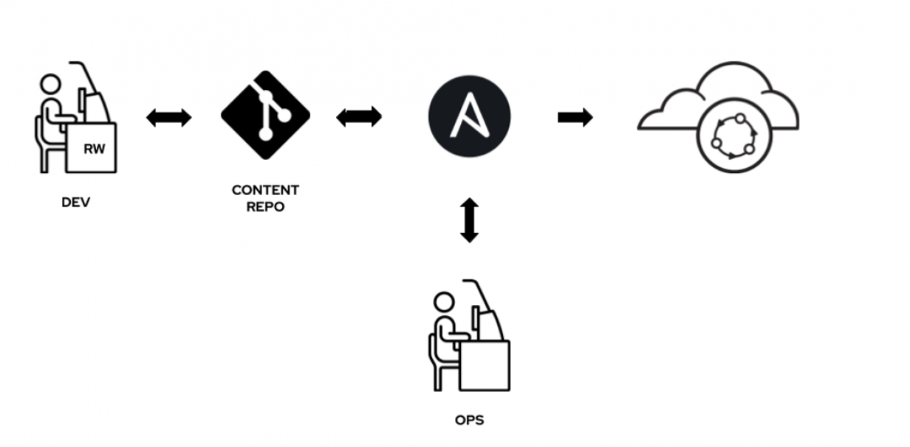
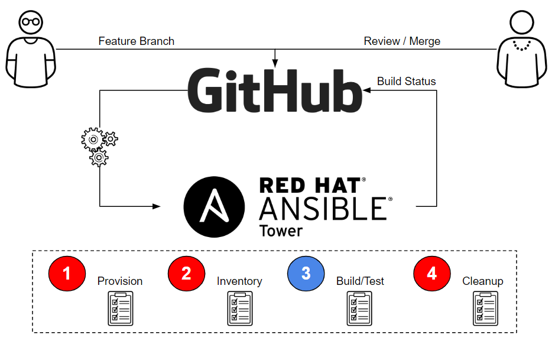

== Introduction

In this labs you will be implementing effective GitOps workflows with the Red Hat Ansible Automation Platform using the webhooks capabilities in Ansible Tower. 

With the release of Red Hat Ansible Tower v3.6, part of the Red Hat Ansible Automation Platform, we introduced Automation Webhooks to natively enable easier and more intuitive Git-centric workflows. Such workflows might be found with GitOps-oriented environments.

GitOps is a prescriptive style of Infrastructure as Code based on the experience and wisdom of what works in deploying and managing large, sophisticated, distributed, and cloud-native systems. While you can implement Git-centric workflows, where you treat infrastructure like it is code, that doesn't mean it's GitOps.

== Understanding Infrastructures-as-Code

Infrastructure-as-Code (IaC) means managing and provisioning computing resources through human-readable and machine-consumable definition files, rather than using physical hardware configuration or interactive configuration tools.

It is considered one of the essential practices of DevOps, along with continuous integration (CI), continuous delivery (CD), observability, and others. DevOps automates development and operations processes and creates a faster release cycle with higher quality.

Ansible is a prime example of a tool that enables organizations to apply IaC techniques to their DevOps workflow.

As an Ansible user, you define the desired state of your infrastructure — servers, cloud resources, networking — by using playbooks and roles that are expressed in YAML. 

*Image-1*

== Understanding an IaC Ansible pipeline

If you are treating your infrastructure as code, then you need a source control system. These days, when it comes to source control, we're talking about Git, the distributed source control system that has become the de facto standard in the space.

With Git for source control and Ansible to manage the state of your infrastructure, then all that is missing is the ability to automate what's in a repository and having Ansible apply the configurations to your infrastructure.

== Introduction to Automation Webhooks

Automation Webhooks were introduced to Ansible Tower v3.6 as part of the Ansible Automation Platform.

Automation Webhooks allow you to link a Git repository and Ansible automation natively. Once a repo link is set up, Ansible catches events (Git commits) from the Git system (GitHub, GitHub Enterprise, GitLab). It then uses those events to trigger automation jobs to update projects, manage inventories, and perform deployments, all without requiring yet another tool such as Jenkins.

*Image-2*

