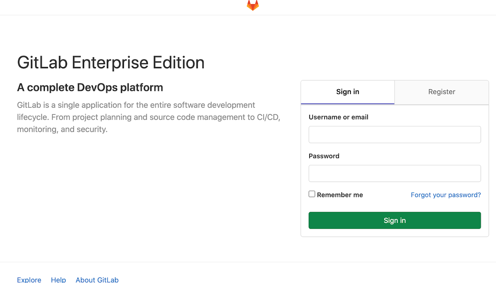

:GUID: %guid%
:OSP_DOMAIN: %subdomain_base_suffix%
:GITLAB_URL: %gitlab_url%
:GITLAB_USERNAME: %gitlab_username%
:GITLAB_PASSWORD: %gitlab_password%
:TOWER_URL: %tower_url%
:TOWER_ADMIN_USER: %tower_admin_user%
:TOWER_ADMIN_PASSWORD: %tower_admin_password%
:SSH_COMMAND: %ssh_command%
:SSH_PASSWORD: %ssh_password%
:VSCODE_UI_URL: %vscode_ui_url%
:VSCODE_UI_PASSWORD: %vscode_ui_password%
:organization_name: Default
:gitlab_project: ansible/gitops-lab
:project_prod: Project gitOps - Prod
:project_test: Project gitOps - Test
:inventory_prod: GitOps inventory - Prod Env
:inventory_test: GitOps inventory - Test Env
:credential_machine: host_credential
:credential_git: gitlab_credential
:credential_git_token: gitlab_token 
:credential_openstack: cloud_credential
:jobtemplate_prod: App deployer - Prod Env
:jobtemplate_test: App deployer - Test Env
:source-linenums-option:        
:markup-in-source: verbatim,attributes,quotes
:show_solution: true

In this section you will explore Gitlab UI.

. Sign in to Gitlab web UI.
+
Open browser and type *{{GITLAB_URL}*, Enter your login details `{GITLAB_USERNAME}` and `{GITLAB_PASSWORD}`, as provided.

*Image-1*

